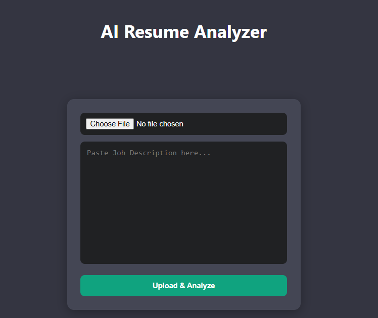

# React + Vite

This template provides a minimal setup to get React working in Vite with HMR and some ESLint rules.

Currently, two official plugins are available:

- [@vitejs/plugin-react](https://github.com/vitejs/vite-plugin-react/blob/main/packages/plugin-react) uses [Oxc](https://oxc.rs)
- [@vitejs/plugin-react-swc](https://github.com/vitejs/vite-plugin-react/blob/main/packages/plugin-react-swc) uses [SWC](https://swc.rs/)

## React Compiler

The React Compiler is not enabled on this template because of its impact on dev & build performances. To add it, see [this documentation](https://react.dev/learn/react-compiler/installation).

## Expanding the ESLint configuration

If you are developing a production application, we recommend using TypeScript with type-aware lint rules enabled. Check out the [TS template](https://github.com/vitejs/vite/tree/main/packages/create-vite/template-react-ts) for information on how to integrate TypeScript and [`typescript-eslint`](https://typescript-eslint.io) in your project.
# ResumeAnalyzer-use-AI-API-Frontend-backend

An intelligent full-stack web application that analyzes resumes against job descriptions, calculates ATS score, identifies missing skills, and provides actionable suggestions using AI.

🚀 Features
📤 Upload PDF resume
🧠 AI-powered resume analysis
📊 ATS Score calculation (real logic)
🎯 Match resume with job description
❌ Highlight missing skills
✅ Show matched skills
💡 Smart suggestions to improve resume
🎨 Modern ChatGPT-style UI
📦 Drag & Drop file upload
⏳ Loading spinner while analyzing
🛠️ Tech Stack
Frontend
React.js
CSS (Custom UI / Chat-style layout)
Backend
Node.js
Express.js
Multer (file upload)
pdf-parse (resume text extraction)
AI API
OpenRouter (or OpenAI)
📁 Project Structure
ai-resume-analyzer/
│
├── client/                  # React Frontend
│   ├── src/
│   │   ├── components/
│   │   │   ├── App.css
│   │   │   ├── Results.css
│   │   │   ├── Input.jsx
│   │   │   ├── Results.jsx
│   │   │   ├── Loader.jsx
│   │   │   |   ├──Css/
                    ├── 
│   │   │           ├── Results.css
│   │   │           ├── Input.css
│   │   │           ├── loader.css
│   │   ├── services/
│   │   │   └── api.jsx
│   │   │
│   │   ├
│   │   │
│   │   ├── App.jsx
│   │   └── main.jsx
│   │
│   └── package.json
│
├── server/                  # Backend
│   ├── controllers/
│   │   └── analyzeController.js
│   │
│   ├── routes/
│   │   └── analyze.js
│   │
│   ├── uploads/             # Temporary uploaded files
│   │
│   ├── server.js
│   └── package.json
│
├── .gitignore
├── README.md
└── package.json
⚙️ Installation & Setup
1️⃣ Clone Repository
git clone https://github.com/nivi1998/ResumeAnalyzer-use-AI-API-Frontend-backend.git
cd ai-resume-analyzer
2️⃣ Setup Backend
cd server
npm install

Create .env file:

OPENAI_API_KEY=your_api_key_here

Run backend:

npm start

Server runs on:

http://localhost:5000
3️⃣ Setup Frontend
cd client
npm install
npm run dev

Frontend runs on:

http://localhost:5173
🔑 API Setup
Option 1: OpenRouter (Recommended)
Go to: https://openrouter.ai/
Create account
Generate API Key
Use model:
openai/gpt-3.5-turbo
Option 2: OpenAI
Go to: https://platform.openai.com/
Generate API key
Add to .env
📊 ATS Score Logic

The ATS score is calculated based on:

✅ Skill Match (60%)
🔍 Keyword Match (20%)
📄 Resume Length (10%)
🤖 AI Feedback (10%)
📸 Screenshots (Optional)

UI Screenshot

🧪 Future Improvements
🧾 Multiple job description support
📥 Download optimized resume
🌐 Deploy to cloud (Vercel + Render)
📊 Detailed analytics dashboard

Author

Nivedita
Frontend Developer | React | AI Enthusiast

⭐ Support

If you like this project, give it a ⭐ on GitHub!